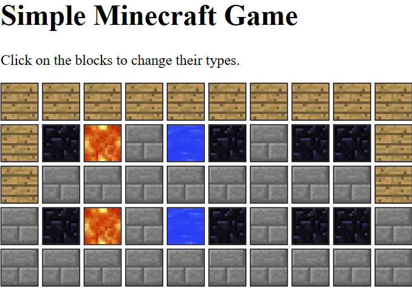
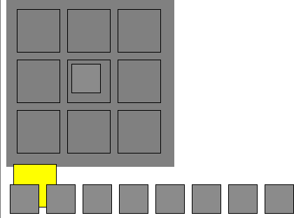
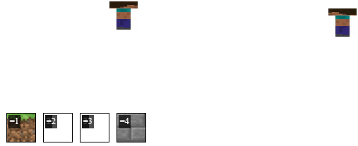
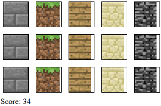

# Crappy Games Repository

Hey there! Welcome to my Crappy Games repository! 😄 Here, you'll find a bunch of experimental game projects, some of which didn't quite hit the mark. Let's take a quick look at a few of them:

## MCbuild (Success)

MCbuild is a 2D bulding game inspired by Minecraft's building mechanics. It was a bit of a struggle during development, but hey, I made it work! you can build and construct buildings using different blocks and tools. Yay for progress!

## MCcraft (Failed)

MCcraft was an ambitious attempt to create a complex Minecraft-style game, but things didn't go as planned. Technical difficulties and time constraints got the best of me, resulting in its failure. But hey, we learn from our mistakes, right?

## MCcreate MULTIPLAYER (Failed)

MCcreate MULTIPLAYER was all about building and creating with your friend in a 2d block game with  arrow key multiplayer support. Sounds cool, right? Sadly, the multiplayer part didn't work out as I hoped, and the project ended up as a failed experiment.

## Mcmine (Complete)

Ah, Mcmine! This one's a winner! It's my first successful project, where I managed to create a fully functional game. It's inspired by classic mining games, where players can mine blocks. Success at last!

Just so you know, these games were created for learning purposes, not for commercial release. Feel free to dive into the repository and check out each game's folder for more details. Got any questions or suggestions? Hit me up anytime!

Happy Coding!
(Crzzzzzzzzzzzzzzzy crxxxxxxxxxxxxxr😊

GitHub Disclaimer: Minecraft Educational Project

This repository and its contents are intended for educational purposes only. The purpose of this project is to learn and demonstrate various concepts related to Minecraft and game development.

Disclaimer:

I, [Your GitHub Username], am not involved, affiliated, or associated with Microsoft, Minecraft, Mojang, or any other companies related to Minecraft.

This project is not an official product of Minecraft, Mojang, or Microsoft.

The use of any trademarks, copyrights, or other intellectual property of Minecraft, Mojang, or Microsoft in this repository is purely for educational and illustrative purposes.

All Minecraft-related content, such as textures, images, and game mechanics, are the property of Mojang and Microsoft.

This project should not be considered as a substitute for the official Minecraft game or any of its components.

Educational Purposes:

The primary purpose of this project is to showcase educational content and learn about game development, programming, and related concepts.

Any usage of code or assets from this repository should be solely for educational purposes and personal learning experiences.

No Warranty:

This repository and its contents are provided "as is," without any warranty, express or implied. The author makes no guarantees regarding the accuracy, functionality, or fitness for a particular purpose of the code and assets.

The author shall not be liable for any claims, damages, or losses arising out of the use or misuse of this repository.

Contribution:

Contributions to this project are welcome, but contributors must adhere to the educational nature of the repository.

By contributing, you acknowledge that your contributions will be treated as educational content and will be distributed under the same disclaimer.

Respect for Copyrights:

Any third-party assets used in this repository have been credited and are used with permission or under fair use guidelines.

If you believe that your copyright or intellectual property rights have been infringed upon, please contact me at oosterhuisjulian0@gmail.com and I will promptly address the concern.

Final Words:

This disclaimer may be subject to change or update without notice. It is your responsibility to check for any updates. By using or accessing this repository, you agree to the terms of this disclaimer.

Remember, this project is purely for educational purposes and not intended to infringe upon the rights of any entity or individual. Enjoy learning and exploring the world of game development with Minecraft!

[oosterhuisjulian0@gmail.com] (contact information)

[Date of Disclaimer] (22/07/2023)
credits:
texture of minecraft blocks
and
steve texture minecraft

